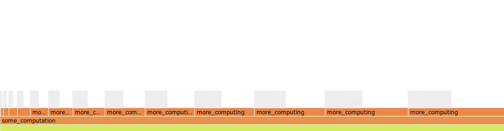

# FLAME
#### A cool flamegraph library for rust

Flamegraphs are a great way to view profiling information.
At a glance, they give you information about how much time your
program spends in critical sections of your code giving you some
much-needed insight into where optimizations may be needed.

Unlike tools like `perf` which have the OS interrupt your running
program repeatedly and reports on every function in your callstack,
FLAME lets you choose what you want to see in the graph by adding
performance instrumentation to your own code.

Simply use any of FLAMEs APIs to annotate the start and end of a
block code that you want timing information from, and FLAME will
organize these timings hierarchically.

### [Docs](https://docs.rs/flame/)

Here's an example of how to use some of FLAMEs APIs:

```rust
extern crate flame;

use std::fs::File;

fn main() {
    // Manual `start` and `end`
    flame::start("read file");
    let x = read_a_file();
    flame::end("read file");

    // Time the execution of a closure.  (the result of the closure is returned)
    let y = flame::span_of("database query", || query_database());

    // Time the execution of a block by creating a guard.
    let z = {
        let _guard = flame::start_guard("cpu-heavy calculation");
        cpu_heavy_operations_1();
        // Notes can be used to annotate a particular instant in time.
        flame::note("something interesting happened", None);
        cpu_heavy_operations_2()
    };

    // Dump the report to disk
    flame::dump_html(&mut File::create("flame-graph.html").unwrap()).unwrap();
    
    // Or read and process the data yourself!
    let spans = flame::spans();
    
    println!("{} {} {}", x, y, z);
}
```

And here's a screenshot of a flamegraph produced by `dump_html` (from a different project):


### Full Example
```rust
use std::fs::File;

use flame;

fn make_vec(size: usize) -> Vec<u32> {
    // start_guard needs to drop to calculate duration.
    let _fg = ::flame::start_guard("make_vec");

    let mut res = flame::span_of("vec init", || vec![0_u32; size]);
    for x in 0..size {
        res[x] = ((x + 10)/3) as u32;
    }
    let mut waste_time = 0;
    for i in 0..size*10 {
        waste_time += i
    }
    res
}

fn more_computing(i: usize) {
    let _fg = ::flame::start_guard("more_computation");

    for x in 0..(i * 100) {
        let mut v = make_vec(x);
        let x = Vec::from(&v[..]);
        for i in 0..v.len() {
            let flip = (v.len() - 1) - i as usize;
            v[i] = x[flip];
        }
    }
}

fn some_computation() {
    let _fg = ::flame::start_guard("some_computation");

    for i in 0..15 {
        more_computing(i);
    }
}


fn main() {
    let _fg = ::flame::start_guard("main");
    
    some_computation();
    // in order to create the flamegraph you must call one of the
    // flame::dump_* functions.
    flame::dump_html(File::create("flamegraph.html").unwrap()).unwrap();
}
```

Below is the resulting flamegraph.



[llogiq](https://github.com/llogiq) has created [flamer](https://github.com/llogiq/flamer),
a compiler plugin that automatically inserts FLAME instrumentation into annotated functions
allowing you to write code like

```rust
#[flame]
fn this_function_is_profiled() {
    ...
}
```
